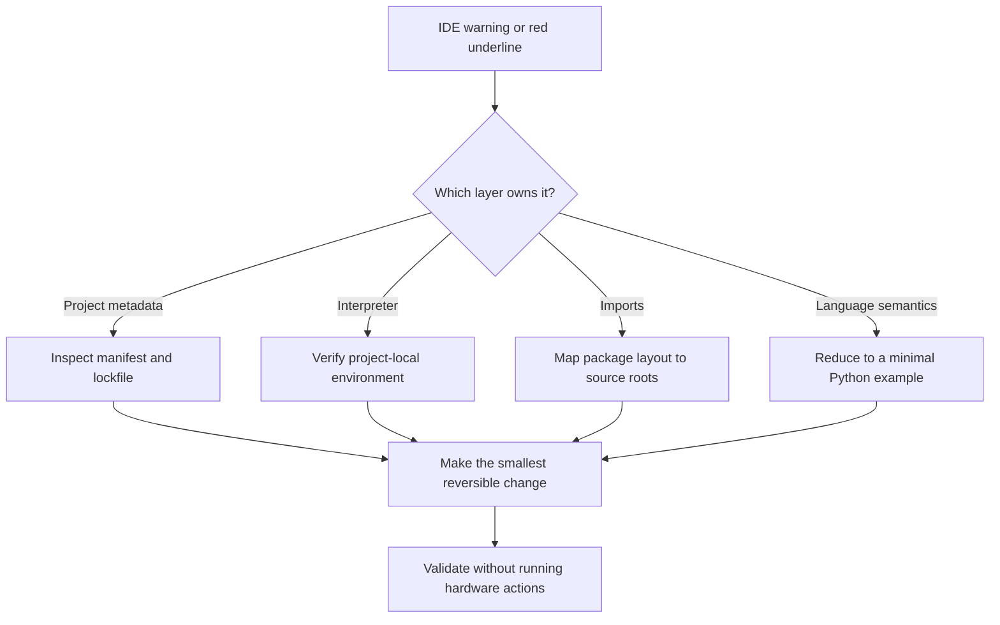

# Python IDE Debugging Field Notes

A privacy-safe engineering guide to three Python IDE problems that often appear together in inherited or hardware-adjacent workspaces:

1. an IDE detects a `pyproject.toml` workspace and offers to rebuild project settings;
2. a nested directory is marked as a source root; and
3. a bare `raise` is flagged outside an exception handler.

The examples are intentionally synthetic. Names, paths, dependencies, versions, measurements, and repository structure have been changed to protect the original project.

## Why this repository exists

An IDE notification can look like a runtime failure even when it is only describing project metadata. The safest response is to separate four layers before changing anything:

- dependency metadata;
- interpreter state;
- import-path configuration; and
- Python runtime semantics.

This repository turns that diagnostic sequence into a reusable checklist.

## How to use this guide

There is nothing to install. Read the diagnostic model, identify which layer owns your symptom, and adapt only the relevant synthetic example to your own repository. Commands and package names in this guide are illustrative; confirm the real setup procedure in your project's documentation before running anything.

## Diagnostic model



## Case 1: workspace detection is not a runtime error

When an IDE detects `pyproject.toml`, it may offer an experimental workspace mode that derives modules and dependencies from project metadata. Enabling it can replace manual IDE settings, so the prompt deserves a deliberate decision.

### Safe procedure

1. Confirm that the manifest and lockfile belong to the project.
2. Inspect the documented setup command.
3. Back up IDE metadata if it contains valuable run configurations.
4. Create or synchronize a project-local virtual environment.
5. Point the IDE interpreter at that environment.
6. Decline the workspace migration when the existing module setup is intentional.

Generic example—replace `envtool` with the environment manager documented by your project before running it:

```powershell
envtool sync
.\.venv\Scripts\python.exe --version
.\.venv\Scripts\python.exe -c "print('interpreter ready')"
```

### Validation boundary

For hardware-adjacent software, validate syntax and imports without executing the main script. A successful import check does not authorize sensor writes, firmware programming, device resets, or other physical side effects.

```powershell
.\.venv\Scripts\python.exe -m py_compile app.py
```

## Case 2: a source root explains top-level imports

Consider this synthetic layout:

```text
workspace/
├── app.py
└── vendor_runtime/
    ├── device_api/
    │   └── __init__.py
    └── common_utils/
        └── __init__.py
```

If `app.py` contains this import:

```python
import device_api
```

then `vendor_runtime/` must be on `sys.path`. Marking `vendor_runtime/` as a source root tells the IDE that packages beneath it are top-level import candidates. Reverting the mark can produce unresolved-import inspections or `ModuleNotFoundError` at runtime.

Before accepting or reverting a source-root notification, answer one question: does the code import `device_api`, or does it import `vendor_runtime.device_api`? The first form supports the nested source root; the second supports the repository root.

A side-effect-free resolution check is preferable to importing a hardware-facing package:

```python
import importlib.util
import pathlib
import sys

sys.path.insert(0, str(pathlib.Path("vendor_runtime").resolve()))
assert importlib.util.find_spec("device_api") is not None
```

## Case 3: bare `raise` means “rethrow”

A bare `raise` does not create a new exception. It rethrows the exception currently handled by an `except` block.

Correct rethrow (illustrative fragment; `read_configuration` and `logger` represent application-specific functions):

```python
try:
    read_configuration()
except OSError:
    logger.exception("Configuration read failed")
    raise
```

Incorrect use:

```python
if not supported_mode:
    raise
```

With no active exception, Python cannot determine what to rethrow. Raise an explicit exception instead:

```python
if not supported_mode:
    raise RuntimeError("This workflow supports only the configured demonstration mode")
```

Choose the narrowest useful exception type: `ValueError` for an invalid value, `FileNotFoundError` for a missing file, `NotImplementedError` for a deliberately unavailable implementation, or `RuntimeError` for an invalid runtime state that lacks a better built-in type.

## Safety model

- Treat IDE prompts as configuration changes, not instructions to click immediately.
- Preserve existing project settings until their purpose is understood.
- Use a project-local interpreter rather than a machine-wide environment.
- Resolve package locations without importing modules that initialize devices.
- Prefer syntax checks and focused dependency checks over running the entry point.
- Never publish original paths, package inventories, hardware identifiers, binary names, measurements, keys, certificates, logs, or architecture diagrams from a sensitive workspace.

## Diagnostic outcomes

Applied to an appropriate workspace, the workflow targets three independently verifiable outcomes:

- a project interpreter that is isolated and can load declared dependencies;
- an IDE import model that matches the Python import model; and
- replacement of an invalid bare `raise` with an intentional, descriptive exception.

No claim is made that the underlying hardware workflow was executed. That requires separate authorization, equipment readiness, and device-specific validation.

## Lessons learned

1. Classify the layer before applying a fix.
2. IDE metadata is part of the executable developer experience.
3. Import paths are architectural decisions, even in small scripts.
4. Error messages should explain violated assumptions.
5. Privacy-safe teaching should preserve reasoning while changing identifying facts.

## Repository structure

```text
.
├── .gitignore
├── LICENSE
└── README.md
```

## Future improvements

- Add a small synthetic repository that reproduces each inspection.
- Add automated checks for documentation links and secret patterns.
- Compare import behavior across IDE launch, terminal launch, and test runners.
- Add a decision tree for `ValueError`, `RuntimeError`, and custom exceptions.

## License

MIT
